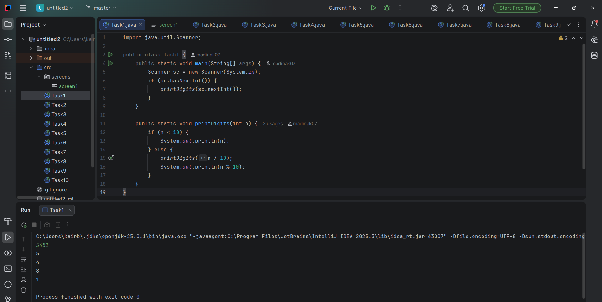
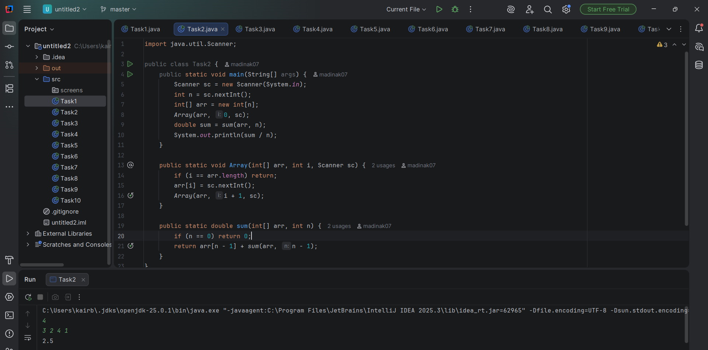
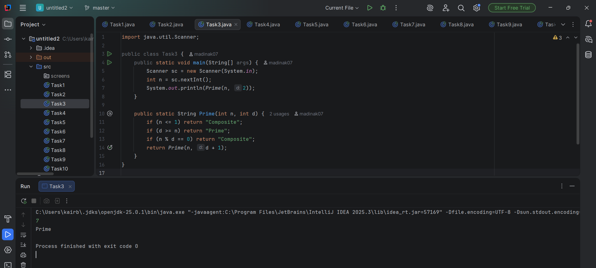
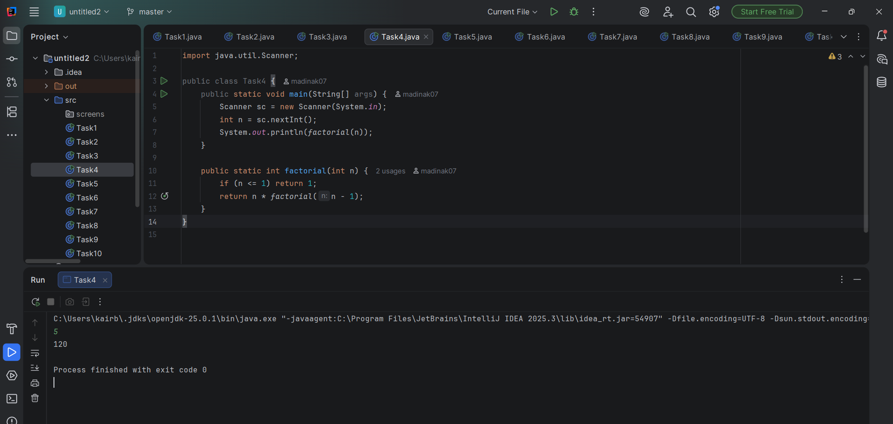
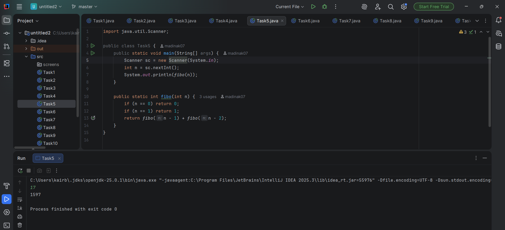
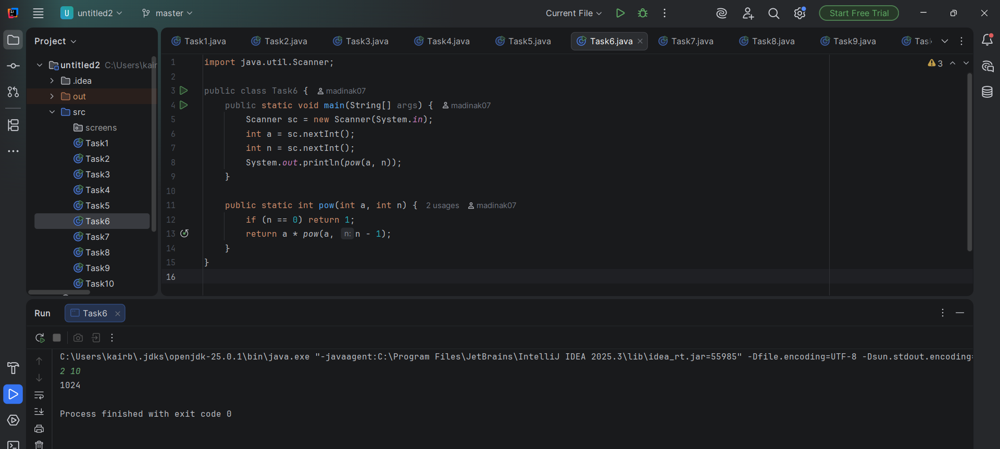
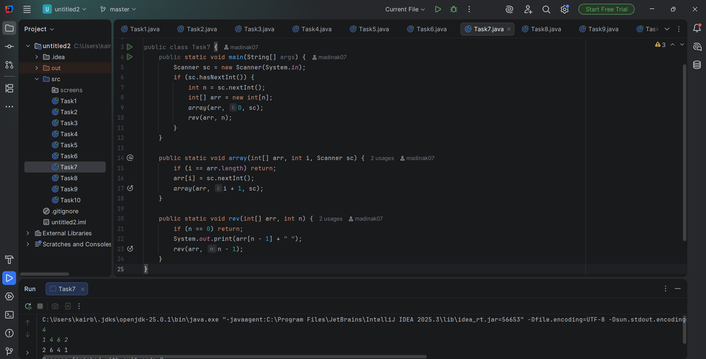
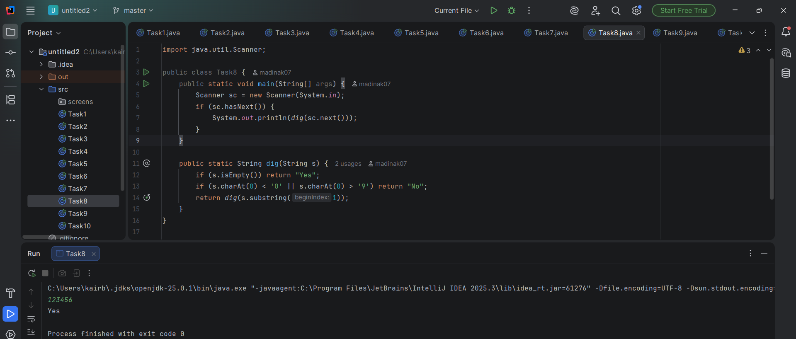
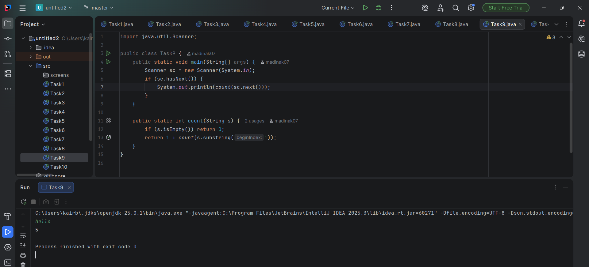
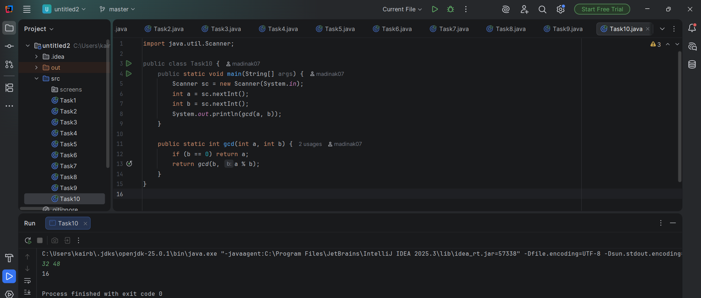

Assignment #1. Recursion
Student: Kairbayeva Madina
Group: IT-2504

Part 1. Recursion with Numbers

Task 1. Print Digits of a Number

Task 2. Average of Elements

Task 3. Prime Number Check

Task 4. Factorial

Part 2. Recursion with Sequences

Task 5. Fibonacci Number

Task 6. Power Function

Task 7. Reverse Output

Part 3. Recursion with Strings

Task 8. Check Digits in String

Task 9. Count Characters in a String

Task 10. Greatest Common Divisor (GCD)

Work Process Summary

In this work I solved different tasks using recursion in Java. I wrote several recursive functions for working with numbers, sequences, and strings. I used base cases and recursive calls to solve each problem step by step. All tasks were tested with example inputs and the program produced correct outputs. This work helped me better understand how recursion works in programming.
